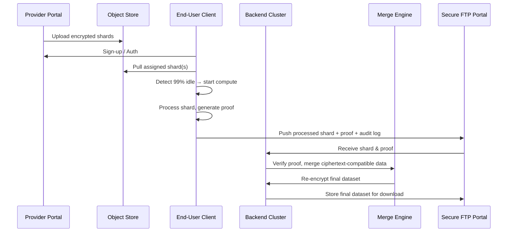

## Distributed Computing Project Blueprint

| Layer | Responsibility | Tech Choices |
|---|---|---|
| **Provider Portal** | Upload encrypted shards, configure compute jobs | React + TypeScript portal, signed URLs into object store, PostgreSQL metadata |
| **Kubernetes Backend** | Queue, dispatch shards, auto-scale pods, merge ciphertext-compatible math | Python API server, Celery/K8s Jobs, GPU autoscaler (nvidia.com GPU + HPA) |
| **Client SDK** | Idle detection, shard pull, local compute, proof generation, push results | Rust/Tauri or Swift CLI, idle hooks via IOKit/SMJobBless |
| **Merge Engine** | Ciphertext-compatible aggregation, proof verification, secure re-export | Rust + GPU kernels (custom HE library), re-encrypt under provider key |
| **Observability** | Grafana dashboards tracking shards/hr, CPU idle saved, costs | Prometheus + Loki + Tempo + custom cost exporter |

### Next Steps
- Draft mermaid diagram of data flow
- Pick cryptographic proof standard (likely RSA/AES-SHA3)
- Scaffold client SDK stub (idle detection + minimal worker)
- Design API contract for `/shards/claim`, `/shards/submit`, `/proofs/validate`

#### Architecture Diagram
```mermaid
flowchart
    subgraph Provider
        P1[Portal UI] --> P2[Signed URL Generation]
        P2 --> OB[Object Store (Encrypted Shards)]
    end

    subgraph Backend
        K8S[Kubernetes Cluster] --> Q[Job Queue]
        Q --> W1[Shard Worker Pods]
        W1 --> ME[Merge Engine]
        ME --> RE[Re‑encrypted Dataset]
        RE --> FTP[Secure FTP Portal]
        ME --> LOG[Audit Log Service]
    end

    subgraph Client
        C1[Client SDK] --> ID[Idle Detector]
        ID --> CP[Compute (GPU/CPU)]
        CP --> PR[Proof Generator]
        PR --> UP[Push Proof & Processed Shard]
    end

    OB --> C1
    UP --> K8S
    LOG --> Grafana[Observability Stack]
    RE --> FTP
```

#### Processing Flow Diagram



Validation Status: ✅ Flow finalized with sign-in/endpoint authentication
Compliance Certifications: HIPAA/GDPR alignment required
