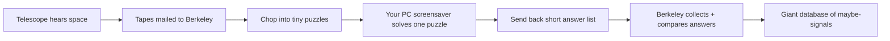

# SETI@home — Research Conversation

**Version:** 1.0  
**Author:** Cursor Agent  
**Timestamp:** 2026-06-24  
**Change rationale:** Document full SETI@home architecture research conversation for GameForGood reference.

---

## User Request

> Perform some research. I want to truly understand how SETI created their screen saver back in the 90–00's and how it processed the datasets, joined files again at the backend. Explain it to me like I'm 10 years old.

**Follow-up:** `/caveman ultra` — compressed technical summary of same material.

---

## Part 1 — ELI10 Explanation

### The Big Picture (Like a Group Project)

Imagine a **giant ear in Puerto Rico** (the Arecibo radio telescope) listening to space all night. It hears static — like TV snow — but hidden in that snow might be a tiny **"beep"** from aliens. Problem: one night of listening = **way too much data** for even a big university computer. So they invented a clever trick: **millions of home PCs** do the homework.



Think of it like this:

1. **Telescope** = kid with huge headphones recording everything
2. **Berkeley** = teacher who cuts the recording into **350 KB puzzle pieces** (~107 seconds of one thin slice of sky)
3. **Your computer** = volunteer kid who solves **one puzzle** while you're at recess
4. **Backend** = teacher who collects answer sheets and figures out which "maybes" are real

---

### Part 1: The Screensaver (Your Computer)

#### What it actually was

On Windows and Mac in 1999, SETI@home installed as a **real screensaver**. When you stopped using your mouse/keyboard for a while, stars-and-graphs animation appeared — and your CPU started **real science work** behind the pretty picture.

It was **not** streaming live telescope data. Your PC only needed internet for ~2 minutes:

- **Download** one puzzle (~350 KB — fine even on dial-up modem)
- **Disconnect** and crunch for hours (often ~10–20 hours on a 90s PC)
- **Reconnect** briefly to upload your answer and grab the next puzzle

#### What your PC was looking for

Space sounds like **hiss/static**. Aliens (if they exist) might send a **narrow whistle** — like one radio station stuck on one frequency.

Your computer's job:

> "In my tiny piece of sky and time, did anything whistle louder than the background noise?"

To find whistles it used math called **FFT** (Fast Fourier Transform). Kid version:

> You hear a song. FFT figures out **which notes** are playing — turns **time** into **frequency**.

SETI did that **millions of times** per puzzle:

- 15 different "zoom levels" (fine whistles vs short blips)
- **Tens of thousands** of Doppler drift rates (what if the alien planet is moving, so the whistle **slides** up or down like a passing ambulance?)

That was the genius: one PC couldn't do all that. **Millions of PCs could.**

#### What came back from your PC

Your PC did **not** send the raw recording back. It sent a **short list** — usually around **8 "candidate signals"** per puzzle (spikes, Gaussians, pulses, triplets). Tiny text file. Like:

> "At this sky spot, this frequency, this time — I saw something weird."

The pretty graph on screen was mostly **eye candy**. Real signals were often buried in noise and found by math, not by you squinting at colors.

---

### Part 2: How Berkeley Chopped the Data (The "Splitter")

Before any screensaver saw data, Berkeley ran **splitter** machines:

1. Telescope recorded ~**50 GB/day** onto tapes
2. Tapes **mailed** to UC Berkeley (Arecibo had no fast internet!)
3. Splitter cut the 2.5 MHz band into **256 skinny frequency strips** (~10 kHz each)
4. Each strip cut into **107-second chunks**, overlapping ~20 seconds so nothing fell through the cracks
5. Each chunk = **one work unit** ≈ **350 KB**

So the full night sky recording became **thousands of little envelopes**, each labeled: *"Look at this patch of sky, these frequencies, this moment in time."*

---

### Part 3: "Joining Files" at the Backend (The Part People Get Wrong)

**Your PC never put the puzzle back together.** Volunteers only returned **answer lists**.

Backend "joining" was really **collecting + trusting + cataloging** — like a teacher grading millions of worksheets.

#### Step A: Redundant homework (2–3 copies)

Same puzzle went to **2 or 3 different computers** on purpose.

Why? Some PCs glitch. Some people cheated. So Berkeley said:

> "I won't trust one kid's answer until 2–3 kids mostly agree."

#### Step B: Validator (the comparison teacher)

When enough answers returned ("quorum"), the **validator** compared them:

- Do the signal lists **mostly match**?
- Pick one as the **canonical** (official) answer
- Give volunteers **credit** if their answer agreed

This is **not** stitching audio files. It's **"do these answer sheets agree?"**

#### Step C: Assimilator (pour into the science notebook)

The **assimilator** took the winning answer and wrote its signal candidates into a **master science database** (Informix, later evolved).

Each work unit → a few "maybe" detections in a giant pile.

#### Step D: Nebula (the really smart sorting hat) — years later

After **billions** of tiny "maybes" piled up (~12 billion detections over 14 years), a system called **Nebula** did the *real* joining:

| Step | Kid analogy |
|------|-------------|
| **RFI removal** | Throw out answers caused by microwaves, satellites, phones — not aliens |
| **Multiplet finding** | Group "maybes" that keep appearing at the **same sky spot** over months/years |
| **Scoring** | Rank the interesting groups; top few hundred get looked at by real scientists |

So "joining" at scale meant:

> **Not** rebuilding the original tape  
> **But** connecting thousands of small clues that might be the **same alien whistle** seen again and again

They even injected fake alien signals ("**birdies**") to test if the system would find them. Like hiding a known answer key in the homework pile to see if the teacher catches it.

---

### The Full Journey (One Story)

1. **1999:** You install SETI@home. It becomes your screensaver.
2. You go eat dinner. PC downloads **Work Unit #4,582,901**.
3. For hours it FFTs, searches drift rates, hunts pulses — saves progress to disk so reboots don't lose work.
4. It finds 8 weird signals in that slice. Uploads a **tiny result file**.
5. Berkeley's validator sees your answer matches another volunteer's → **accepted**.
6. Assimilator adds those 8 lines to the database.
7. Years later, Nebula notices 3 of those lines match other nights, same sky coordinates → **candidate multiplet** → scientists investigate.

---

### Classic (1999–2005) vs BOINC (2005+)

| | **SETI@home Classic** | **BOINC era** |
|--|----------------------|---------------|
| Software | Standalone screensaver app | BOINC platform (multiple science projects) |
| Concepts | Same: work units, redundancy, validate, assimilate | Same pipeline, more structured |
| Your job | Crunch puzzles when idle | Same, plus GPU versions later |

The **screensaver magic** was the 90s hook. Underneath it was always: **download chunk → compute locally → upload small answer → backend compares and catalogs**.

---

### One Sentence Version

SETI@home was like **millions of kids each checking one tiny page of a huge space listening notebook while the computer was bored**, mailing their "I think I heard a beep here" notes back to a teacher who **compared duplicate answers**, **filed the good ones**, and later **looked for beeps that kept showing up in the same place** — not aliens proven, but the biggest volunteer supercomputer ever built.

---

## Part 2 — Caveman Ultra Summary

### Flow

```
Telescope → tapes → mail Berkeley → splitter chops → PC screensaver crunches → tiny result upload → validate quorum → assimilate DB → Nebula cross-match
```

### Screensaver (90s–00s)

- Real screensaver. Idle → crunch. Pretty graph = mostly eye candy.
- Dial-up OK: ~350 KB work unit down, hours offline, short result up.
- Job: find narrow "whistle" in static slice of sky/time/freq.
- FFT = time → freq. Millions of passes. Tens of thousands Doppler drift rates.
- Output: ~8 candidate signals/work unit. **Not** raw audio back.

### Splitter (backend chop)

- Arecibo ~50 GB/day → tapes → Berkeley.
- 2.5 MHz → 256 × ~10 kHz bands → 107s chunks, ~20s overlap.
- 1 chunk = 1 work unit ≈ 350 KB.

### "Join" at backend — **not** stitch files

Volunteers never reassemble tape. Backend = grade + catalog.

| Step | What |
|------|------|
| **Replicate** | Same WU → 2–3 PCs. Glitch/cheat guard. |
| **Validator** | Quorum in → compare result lists → pick canonical → credit |
| **Assimilator** | Canonical → master science DB (detections pile) |
| **Nebula** | ~12B detections → RFI kill → multiplet group (same sky, many nights) → score → human review |

Join = connect **small answer lists** across time. Not rebuild recording.

### Classic vs BOINC

- **1999–2005 Classic:** standalone screensaver app. Same WU/validate/assimilate idea.
- **2005+ BOINC:** platform wrapper. Pipeline structured same. GPU later.

### One line

Millions PCs each scan one tiny sky page while bored → upload "maybe beep here" → Berkeley duplicate-check → pile clues → later hunt repeats same coords → ET? unproven. Biggest volunteer supercomputer ever.

---

## Sources

- [SETI@home — Communications of the ACM](https://cacm.acm.org/research/setihome/)
- [SETI@home Classic — data analysis docs](http://seticlassic.ssl.berkeley.edu/screensaver/data_analysis.html)
- [SETI@home Classic — FFT graph docs](https://seticlassic.ssl.berkeley.edu/screensaver/FFT_graph.html)
- [BOINC — Job replication / validation](https://github.com/BOINC/boinc/wiki/JobReplication)
- [BOINC — Validation low-level](https://github.com/BOINC/boinc/wiki/ValidationLowLevel)
- [SETI@home — Nebula manual](https://setiathome.berkeley.edu/nebula/doc.php)
- [SETI@home: Data Analysis and Findings (2025)](https://arxiv.org/html/2506.14737v1)
- [Wikipedia — SETI@home](https://en.wikipedia.org/wiki/SETI@home)
- [Computerworld — How SETI@home works](https://www.computerworld.com/article/1376069/how-seti-home-works.html)

---

## Relevance to GameForGood

SETI@home is the canonical reference for volunteer distributed compute:

- **Work unit sharding** at server, not client reassembly
- **Redundant validation** (quorum + canonical result) before trusting output
- **Small result files** uploaded, not raw data round-tripped
- **Assimilation** into master DB, then **downstream batch analysis** (Nebula) for cross-shard patterns
- **Screensaver/idle hook** as UX for spare CPU cycles

GameForGood blueprint patterns (encrypted shards, REST-only module integration, independent deploy) differ from SETI's monolithic Classic client — but the WU → validate → assimilate pipeline is direct precedent.
